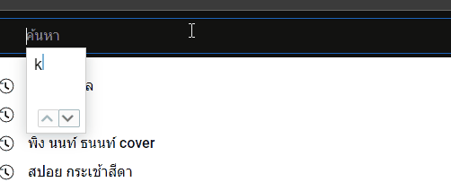

# karaben
a phonetic input method for Thai.
~~pinyin-like style input for Thai pharse using a set of English character.~~


# Pain Point
1. I don't want to buy a thai+english keycap for my mechanical keyboard. English keycap is light lit thru is so beuatiful. the thai keycap is  opaque.
2. I'm not able to spell many common thai words without mistake. 

# existing projects
1. Google Input Tools - this is only works on chrome-based browser.
2. <https://www.lexilogos.com/keyboard/thai.htm>


# Questions 
0. Could we just use Google Input Tools?
Maybe, but it's not open source. It might be done by reverse engineering the browser extension.

1. How to use windows language service? 
They are called [Input Method Editors (IME)](https://learn.microsoft.com/en-us/windows/apps/design/input/input-method-editors).
They requires you to access  `Text Services Framework (TSF)`. Normally, api are in c/c++.

1. Could we communicate with windows language service using Python?
Yes, pls try <https://github.com/EasyIME/PIME> It looks mature and updated.

1. How to Install Python Exe? Best exp is here. <https://github.com/timmo001/system-bridge>
2. What is the good enough way to translate a set of English char to Thai pharse?
3. Are there any karaoke database that we can use?
Nope. But, we can use `pythainlp` to build our own dataset.

1. Could we build an AI model to do this?
Maybe, but that is beyond my knowledge.


# OpenAI ChatGPT Said
> Me: I want to create a phonetic input method for Thai. I want to done it using python. i know `PIME` could bridge the interface to Text Services Framework. but, how to get started

AI:
To create a phonetic input method for Thai using Python, you will first need to have a basic understanding of how input methods work. In general, an input method is a program that allows users to enter complex characters or symbols that cannot be easily typed on a standard keyboard.

Once you have a basic understanding of how input methods work, you can begin exploring the PIME library, which is a Python library that provides an interface to the Text Services Framework (TSF) on Windows. This will allow you to create an input method that can be used in any application that supports TSF, such as Microsoft Office or Google Chrome.

To get started, you will need to install the PIME library by using pip, the Python package manager. You can do this by running the following command:

```
pip install pime
```

Once you have installed the PIME library, you can begin exploring the documentation to learn how to use the various classes and functions provided by the library to create your phonetic input method for Thai. You may also want to look for tutorials or examples online that show how to use PIME to create input methods.


> Me: could `pythainlp` help in doing this?

AI:
Yes, the pythainlp library can be useful for creating a phonetic input method for Thai using Python. pythainlp is a natural language processing library for Thai that provides a wide range of tools and functions for working with Thai text.

One of the key features of pythainlp is its support for various phonetic input methods, such as the Royal Thai General System of Transcription (RTGS) and the New Rauy Wongbej phonetic system. These input methods allow users to enter Thai text using phonetic transcription, which is a way of representing Thai words using the Latin alphabet.

In addition to providing support for phonetic input methods, pythainlp also includes a number of other useful tools for working with Thai text, such as tokenizers, stemmers, and spell checkers. This can be useful for building a complete input method that not only allows users to enter text using phonetic transcription, but also provides other features to help them write and edit Thai text more easily.

To use pythainlp to create a phonetic input method for Thai, you will first need to install the library by using pip, the Python package manager. You can do this by running the following command:

```
pip install pythainlp
```
Once you have installed pythainlp, you can begin exploring the documentation to learn how to use the library's various features to create your phonetic input method. You can also look for tutorials or examples online that show how to use pythainlp to build input methods for Thai.

> Me: could you give some code examples? 

AI:
Here is a simple example of how you might use the pythainlp library to create a phonetic input method for Thai that allows users to enter text using the Royal Thai General System of Transcription (RTGS):

```
import pythainlp

# Define a function that takes a string of phonetic transcription and
# returns the corresponding Thai text
def transcribe_to_thai(text):
  # Use the `rtgs` function from `pythainlp` to transcribe the input text
  # from phonetic transcription to Thai
  thai_text = pythainlp.rtgs(text)
  
  # Return the resulting Thai text
  return thai_text

# Test the transcribe_to_thai function with a simple example
text = "kor tot"
print(transcribe_to_thai(text))

```

When run, this code should print the following output:
```
ขอทำ
```

This simple example shows how you can use the rtgs function from pythainlp to transcribe text from phonetic transcription to Thai. You can use this function as the basis for building a more complete input method that allows users to enter Thai text using phonetic transcription.

Note that this is just a simple example to illustrate how pythainlp can be used to create a phonetic input method for Thai. In practice, you will need to build a more complete input method that includes features such as a user interface, support for different input modes, and integration with the Text Services Framework (TSF) on Windows.